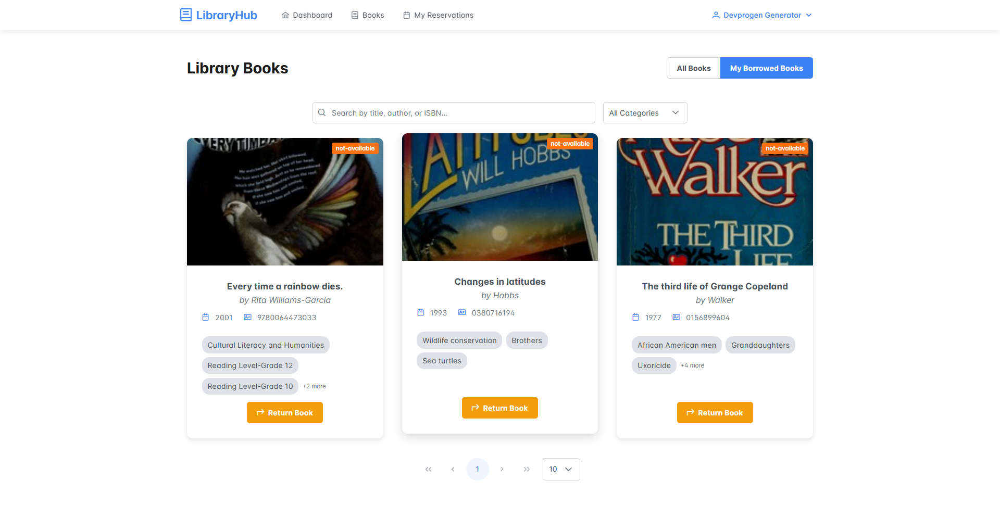
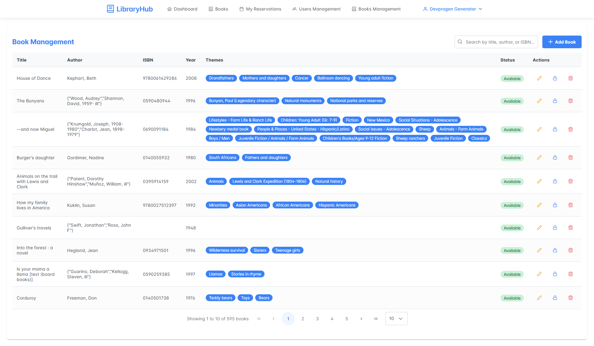
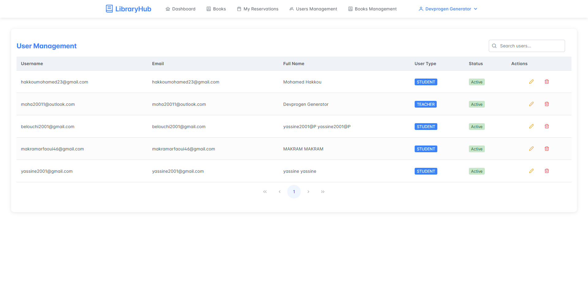

# 📚 LibraryHub

A modern, feature-rich library management system built with Angular 18. LibraryHub provides an intuitive interface for managing books, users, and library operations efficiently.

## 👥 Team

- [Yassine Belouchi](https://github.com/yassineB999) - Developer
- [Mohamed Hakkou](https://github.com/ImMrHak) - Developer

## ✨ Features

- 📖 Comprehensive Book Management
- 👥 User Authentication with Keycloak
- 📊 Interactive Dashboard with Charts
- 🎨 Modern UI with PrimeNG Components
- 🔒 Role-based Access Control
- 📱 Responsive Design

## 🚀 Technologies

- Angular 18.0.0
- PrimeNG 16.9.1
- Chart.js 4.4.7
- Keycloak Integration

## 🔗 Architecture

This project is part of a full-stack application:
- Frontend: Angular 18 (Current repository)
- Backend: Spring Boot ([LibraryHub Backend](https://github.com/yassineB999/LibraryHub))

## 📸 Screenshots

### Dashboard

*Main dashboard showing library statistics and activities*

### My Borrowed Books

*Main My Borrowed Books showing library statistics and activities*

### My Reserved Books

*Main My Reserved Books showing library statistics and activities*

### Book Management

*Interface for managing books and inventory*

### User Management

*User management and permissions interface*

## 🛠️ Prerequisites

- Node.js (v18 or higher)
- npm (latest version)
- Angular CLI 18.0.7

## 📥 Installation

1. Clone the repository:
```bash
git clone https://github.com/yassineB999/LibraryHub-FE.git
cd LibraryHub-FE
```

2. Install dependencies:
```bash
npm install
```

3. Configure environment variables:
   - Create appropriate environment files in `src/environments/`
   - Set up Keycloak configuration

4. Start the development server:
```bash
npm start
```

Navigate to `http://localhost:4200/`. The application will automatically reload if you change any of the source files.

## 🏗️ Build

Run `ng build` to build the project. The build artifacts will be stored in the `dist/` directory.

## 🧪 Testing

- Unit Tests: `npm test`
- End-to-End Tests: `ng e2e`

## 📦 Key Dependencies

- @angular/animations: ^18.0.0
- @primeng/themes: ^19.0.0
- chart.js: ^4.4.7
- keycloak-angular: ^16.1.0
- primeng: ^16.9.1

## 🤝 Contributing

1. Fork the Project
2. Create your Feature Branch (`git checkout -b feature/AmazingFeature`)
3. Commit your Changes (`git commit -m 'Add some AmazingFeature'`)
4. Push to the Branch (`git push origin feature/AmazingFeature`)
5. Open a Pull Request

## 📝 License

This project is licensed under the MIT License - see the LICENSE file for details.

## 🆘 Support

For support and questions, please open an issue in the repository or contact the development team.
